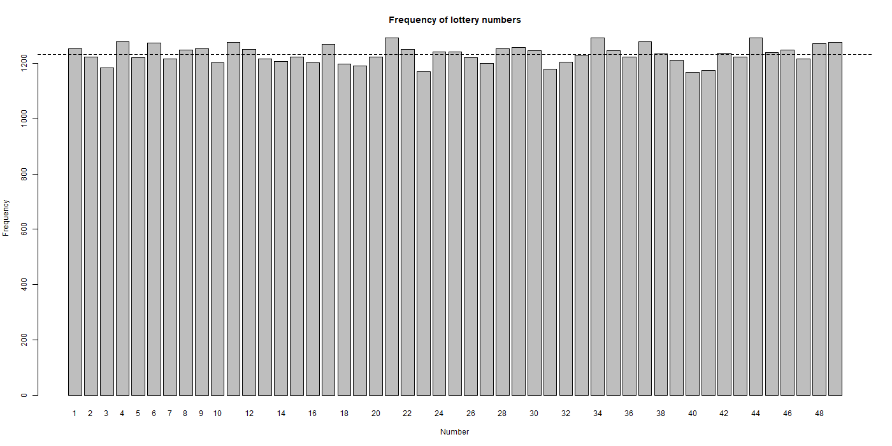
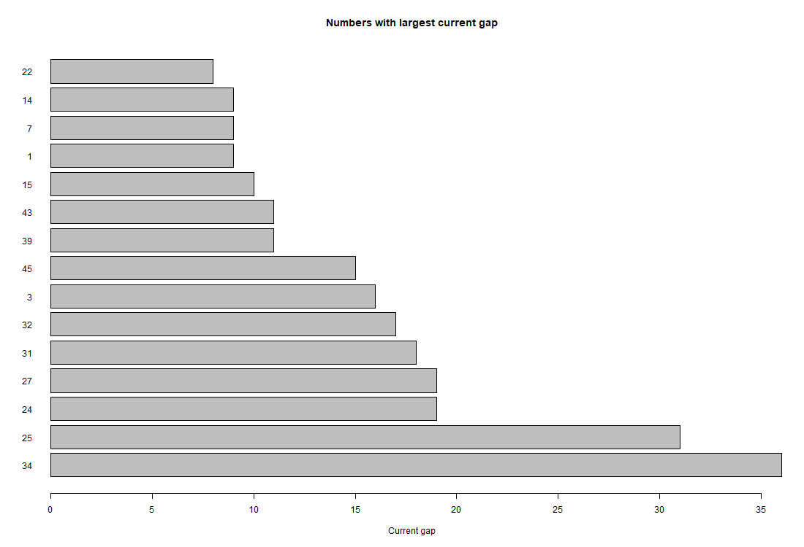
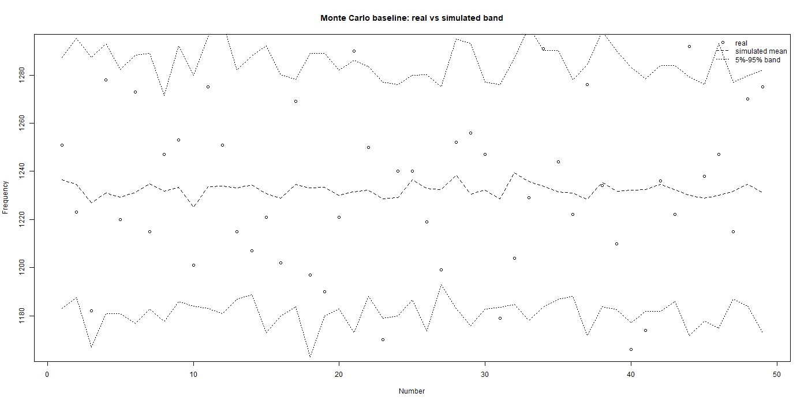

# Lottery Probability Model 6/49

Local Python and Streamlit project for analysis of Bulgarian Toto 2 — 6/49 historical draws. The application combines data validation, probability calculations, statistical models, model comparison, ticket-pack construction, journal tracking, and explanatory ML notebooks.

## Current release state

- Latest dataset row: `2026-07-05`, draw `52`.
- Latest official numbers in the local dataset: `4, 11, 21, 28, 36, 49`.
- Main dataset size: `10062` draw-event rows.
- Normalized datasets are synchronized:
  - `data/historical_draws.csv`
  - `data/v40_normalized_draw_events.csv`
  - `data/v41_canonical_draw_events.csv`
- Current real ticket-pack layer: `3` tickets × `4` lines = `12` combinations.
- Current ticket-pack price model: `10.80 EUR` total at `0.90 EUR` per line.
- ML notebooks are included under `notebooks/` for documentation, visualization, and review.

## Important note

This project does not guarantee winning lottery numbers. A fair 6/49 lottery remains random, and one exact 6-number line has theoretical jackpot odds of:

```text
1 in 13,983,816
```

The models in this project produce relative statistical scores, comparisons, and structured ticket suggestions. They should be treated as analysis and decision-support tools, not as a promise of prediction.

## Main features

- Streamlit dashboard with Bulgarian user interface.
- Official historical draw dataset and data-quality checks.
- Mathematical probability calculator for 6/49.
- Frequency, cold-number, middle/balance, gap/interval, and combined statistical models.
- ML extension layer for classification, clustering, feature analysis, and dimensionality reduction.
- Model comparison, model registry, reliability, and weighting views.
- Ticket-pack builder with real 4-line ticket structure.
- System ticket builder and price table.
- Played-ticket journal using local SQLite storage.
- Add-draw workflow for controlled post-draw updates.
- Explanatory notebooks with tables, charts, and model interpretation.

## Installation

From the project root:

```powershell
python -m pip install --upgrade pip
python -m pip install -r requirements.txt
```

Optional notebook dependencies:

```powershell
python -m pip install -r requirements-notebooks.txt
```

## Run the Streamlit app

Recommended command:

```powershell
python -m streamlit run app.py
```

Alternative direct entrypoint:

```powershell
python -m streamlit run streamlit_app.py
```

The app starts locally and opens a browser dashboard, normally at:

```text
http://localhost:8501
```

## Run the notebooks

Open the notebooks in VS Code or start Jupyter:

```powershell
jupyter notebook
```

Recommended notebook order:

```text
notebooks/00_project_overview.ipynb
notebooks/01_data_overview_and_quality.ipynb
notebooks/02_frequency_model.ipynb
notebooks/03_gap_model.ipynb
notebooks/04_pattern_balance_model.ipynb
notebooks/05_combined_strategy.ipynb
notebooks/06_ml_extensions.ipynb
notebooks/07_model_comparison.ipynb
notebooks/08_ensemble_and_weighting.ipynb
notebooks/09_ticket_builder_and_portfolio.ipynb
notebooks/10_backtest_and_performance.ipynb
notebooks/11_explainability_and_conclusions.ipynb
```

## Useful commands

Dataset audit:

```powershell
python audit_dataset.py
```

Train core models:

```powershell
python train_model.py
python train_cold_model.py
python train_middle_model.py
python train_gap_model.py
python train_combined_model.py
python train_advanced_model.py
```

Run ML extensions:

```powershell
python train_ml_extensions.py
```

Generate prediction artifacts:

```powershell
python predict_next_draw.py
```

Refresh normalized/canonical datasets:

```powershell
python scripts/v40_create_normalized_draw_events.py
python scripts/v41_build_canonical_draw_events.py
```

Refresh post-draw status and current ticket-pack reports:

```powershell
python scripts/v106_build_post_draw_status_sync.py
python scripts/v107_build_model_training_policy_refresh_control.py
python scripts/v108_build_user_menu_live_status_sync.py
python scripts/v117_build_real_ticket_pack_builder.py
python scripts/v117_1_build_add_draw_ticket_pack_price_sync.py
python scripts/v118_build_model_system_ticket_builder.py
```

## Project structure

```text
lottery-probability-model/
├── app.py                         # Streamlit entrypoint wrapper
├── streamlit_app.py                # Main Streamlit dashboard
├── requirements.txt                # App dependencies
├── requirements-notebooks.txt      # Optional notebook dependencies
├── configs/                        # Model configuration
├── data/                           # Local datasets and SQLite journal
├── models/                         # Trained/generated model artifacts
├── notebooks/                      # ML explanation and visualization notebooks
├── reports/                        # Model, audit, and ticket-pack reports
├── scripts/                        # Dataset/model/report build scripts
├── src/                            # Application modules and page sections
└── streamlit_pages/                # Additional Streamlit page modules
```

## Clean package policy

A clean package should exclude temporary development artifacts such as:

```text
.git/
__pycache__/
*.pyc
*.zip
*_patch_files/
_clean_zip_diagnostics/
.ipynb_checkpoints/
```

The functional project files, datasets, model artifacts, reports, notebooks, and local journal database are preserved.

<!-- FINAL_RELEASE_R_LAYER_START -->

## Финален release polish

Този release включва финално подреждане на проекта за GitHub: Streamlit app, datasets, reports, notebooks, R статистически слой и локална политика за journal файловете.

### Streamlit app

Основният вход към приложението е:

```bash
python -m streamlit run app.py
```

`app.py` е кратък wrapper към основния Streamlit app файл. Това позволява проектът да се стартира лесно локално и да остане ясен за GitHub release.

### R статистически слой

Проектът включва независим R статистически слой, който служи за проверка и диагностика на историческите данни.

В Streamlit менюто секцията е достъпна от:

```text
📊 Исторически анализи
    R статистически слой
```

Страницата чете вече генерираните R резултати от:

```text
reports/r/
reports/r/plots/
```

R слойът включва:

- одит на данните;
- честотна статистика;
- gap / interval статистика;
- тестове на разпределението;
- анализ на двойки и модели;
- Monte Carlo baseline;
- PNG графики за визуална проверка.

Важно: R слойът не прави лотарията предвидима. Той е независим статистически контролен слой към Python анализа и моделите.

### R графики

Ключови R графики, включени в release-а:







Допълнителните графики се намират в:

```text
reports/r/plots/
```

### Model training policy

Dataset-ът може да бъде по-нов от част от обучените model artifacts. Това е умишлено разделение между:

```text
dataset update
model retraining
```

Проектът не преобучава всички тежки модели механично след всеки единичен нов тираж, защото един нов lottery draw обикновено не носи достатъчна статистическа стойност за пълно retraining решение.

Това означава:

- dataset-ът може да съдържа последните налични тиражи;
- част от моделите може да са обучени върху малко по-стар snapshot;
- пълно retraining решение трябва да се прави осъзнато, а не автоматично след всеки тираж.

### Local journal policy

Локалният runtime journal файл не трябва да се третира като публичен release artifact:

```text
data/user_journal.db
```

За GitHub release трябва да се използва demo/example snapshot, например:

```text
data/demo_user_journal.db
```

Истинският локален journal state трябва да остане локален и да бъде пазен от commit чрез `.gitignore`, когато проектът се използва реално.

### Reports archive policy

Стари pre-release review/audit отчети могат да бъдат пазени като история, но не трябва да се четат като текуща release истина.

Архивните отчети са отделени концептуално от активните release summaries, например:

```text
reports/archive/
```

Активните release summaries трябва да описват текущото състояние на проекта, dataset-а, app-а и R слоя.

### Lottery disclaimer

Този проект е образователен и аналитичен. Той не гарантира печалба и не променя математическата вероятност за конкретна комбинация.

При игра 6 от 49 шансът за конкретна комбинация остава:

```text
1 in 13,983,816
```

Моделите, статистиките и R слоят служат за анализ, проверка, визуализация и дисциплинирано планиране, не за гарантирано предсказване.

<!-- FINAL_RELEASE_R_LAYER_END -->
